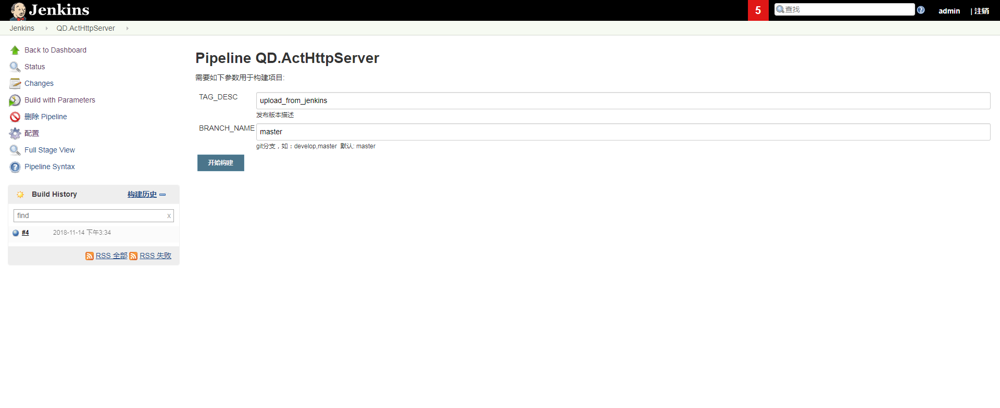
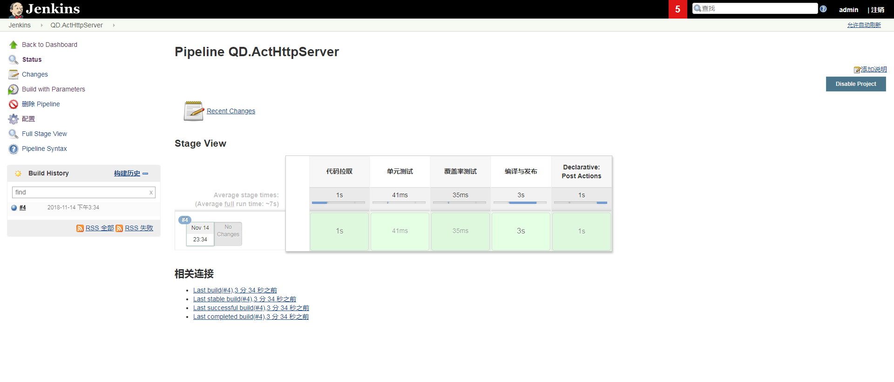
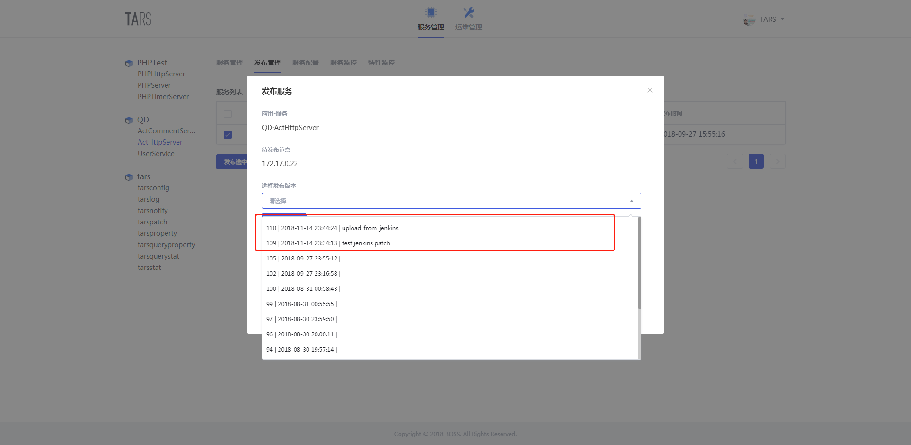

# 持续集成方案
由于Tars的web管理界面暂时未支持集成git/svn，每次发布需要上传zip包极为不方便，这里给出一个基于`jenkins`的持续集成方案方便大家参考。具体业务中可能需要根据实际情况进行调整。

# 操作步骤
> 这里使用 `jenkins` 的pipeline 构建持续集成环境，通过调用tars web管理界面的http接口实现持续集成。下面将以 [github examples](https://github.com/TarsPHP/TarsPHP/tree/master/examples)中的 `QD.ActHttpServer`为例。

1. 新建一个构建节点如**phpenv**，节点可以使docker，包含：
    - `php` 可能会需要多php版本，看具体业务
    - `composer`
    - `jq` Linux下json的命令行工具，方便解析http接口返回的json
    - `phpunit` 非必须
    - `valgrind` 非必须
2. 安装以下`plugin`
    - Valgrind Plug-in
    - Pipeline
    - Workspace Cleanup Plugin
3. 新建一个pipeline job: **QD.ActHttpServer**
3. 在 **Pipeline** 中定义如下 script：
    ```bash
    pipeline {
            agent {
                node {
                    label 'phpenv'
                }
            }
            parameters { 
                string(defaultValue: 'upload_from_jenkins', name: 'TAG_DESC', description: '发布版本描述' )
                string(defaultValue: 'master', name: 'BRANCH_NAME', description: 'git分支，如：develop,master  默认: master')
            }
            environment {
                def JENKINS_HOME = "/home/jenkins"
                def PROJECT_ROOT = "$JENKINS_HOME/workspace/QD.ActHttpServer"
                def APP_NAME = "QD"
                def SERVER_NAME = "ActHttpServer"
            }
            stages {
                stage('代码拉取'){
                    steps {
                        echo "checkout from git"
                        git credentialsId:'2', url: 'https://github.com/TarsPHP/TarsPHP', branch: "${env.BRANCH_NAME}"
                    }
                }
                stage('单元测试') {
                    steps {
                        echo "phpunit 测试"
                        echo "valgrind 测试"
                    }
                }
                stage('覆盖率测试') {
                    steps {
                        echo "LCOV 覆盖率测试"
                    }
                }
                stage('编译与发布') {
                    steps {
                        script {
                            dir("$PROJECT_ROOT/examples/TarsActDemo/QD.ActHttpServer/src") {
                                echo "QD.ActHttpServer 编译与发布"
                                sh "composer install -vvv"
                                sh "composer run-script deploy"
                                sh "ls *.tar.gz > tmp.log"
                                def packageDeploy = sh(script: "head -n 1 tmp.log", returnStdout: true).trim()
                                sh "curl -H 'Host:tars.qidian.local' -F 'suse=@./${packageDeploy}' -F 'application=${APP_NAME}' -F 'module_name=${SERVER_NAME}' -F 'comment=${env.TAG_DESC}' http://tars.qidian.local/pages/server/api/upload_patch_package > curl.log"
                                def packageVer = sh(script: "jq '.data.id' curl.log", returnStdout: true).trim()
                                def postJson = '{"serial":true,"items":[{"server_id":28,"command":"patch_tars","parameters":{"patch_id":' + packageVer + ',"bak_flag":false,"update_text":"${env.TAG_DESC}"}}]}'
                                echo postJson
                                sh "curl -H 'Host:tars.qidian.local' -H 'Content-Type:application/json' -X POST --data '${postJson}' http://tars.qidian.local/pages/server/api/add_task"
                            }
                        }
                    }
                }
            }
            post {
                success {
                    emailext (
                        subject: "[jenkins]构建通知：${env.JOB_NAME} 分支: ${env.BRANCH_NAME} - Build# ${env.BUILD_NUMBER} 成功  !",
                        body: '${SCRIPT, template="groovy-html.template"}',
                        mimeType: 'text/html',
                        to: "liujingfeng.a@yuewen.com",
                    )
                    cleanWs()
                }
                failure {
                    emailext (
                        subject: "[jenkins]构建通知：${env.JOB_NAME} 分支: ${env.BRANCH_NAME} - Build# ${env.BUILD_NUMBER} 失败 !",
                        body: '${SCRIPT, template="groovy-html.template"}',
                        mimeType: 'text/html',
                        to: "liujingfeng.a@yuewen.com",
                    )
                    cleanWs()
                }
            }
        }
    ```
4. 执行构建
    
5. 查看构建结果（邮件通知）
    
5. 查看tars web管理界面
    